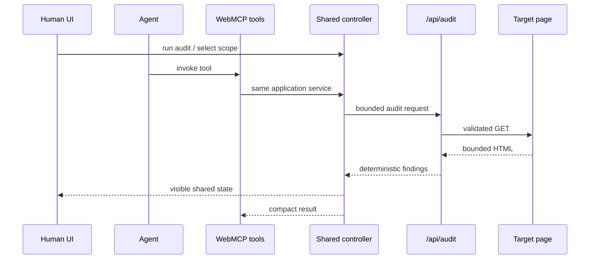

# LoopFix WebMCP architecture

LoopFix is a deliberately small WebMCP application. The browser contains one ephemeral state model for the current audit, selected finding IDs, and verification results. Human controls and WebMCP tools both call the same `LoopFixController`; there is no parallel agent-only implementation.

## Data flow

## Browser boundary

`src/lib/app/state.ts` owns immutable session snapshots. `src/lib/app/controller.ts` is the sole application mutation surface. `src/scripts/loopfix-client.ts` renders state with DOM APIs and `textContent`; fetched page strings are never inserted with active HTML parsing.

The WebMCP surface is implemented with native `document.modelContext.registerTool(...)`. Tool input is constrained by JSON Schema and validated again in JavaScript before controller calls. Registration uses one `AbortController` for lifecycle cleanup, and tool execution forwards WebMCP cancellation signals to network work.

## Worker boundary

`POST /api/audit` accepts exactly `{ "url": string }`. It performs:

1. bounded request-body parsing;
2. coarse anonymous rate limiting;
3. public-target URL policy validation;
4. manual redirect handling with revalidation;
5. response content-type, byte-size, and timeout enforcement;
6. deterministic source inspection;
7. bounded JSON output.

The Worker is stateless. No account, database, audit history, cookies, or API keys are required.

## Verification

Live verification reuses the active audit's canonical URL; neither the human verification button nor `verify_fix_scope` accepts a replacement URL. The fresh audit is compared to stable `finding:<code>` identities selected from the original run.

Demo mode uses two committed deterministic fixtures for the same reserved `.example` URL. It exercises the same browser comparison and state paths without pretending a network request occurred.
